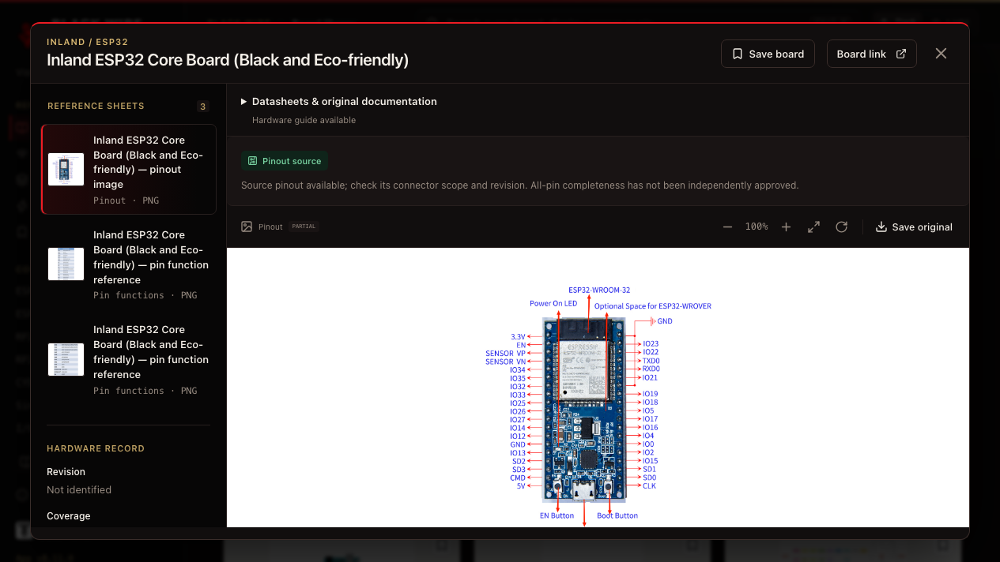
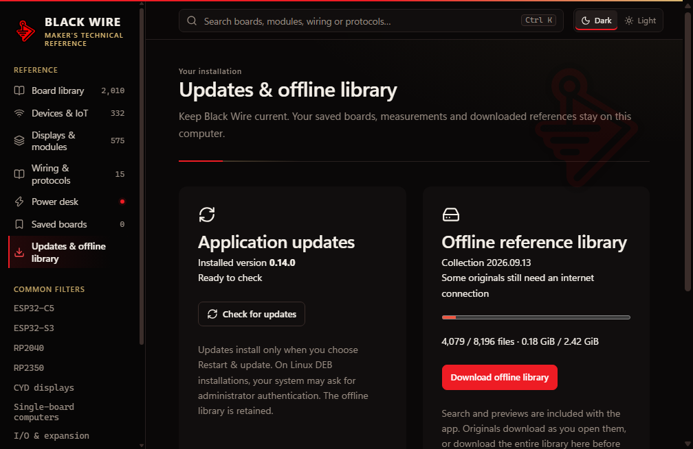
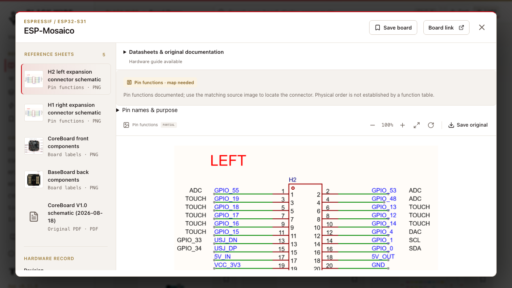
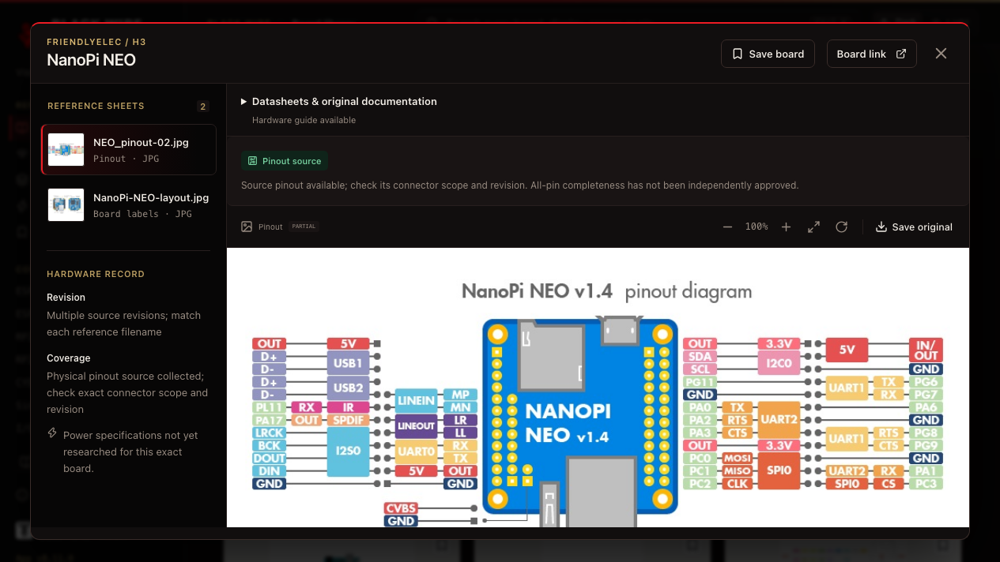
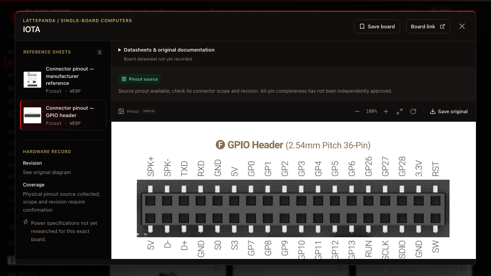
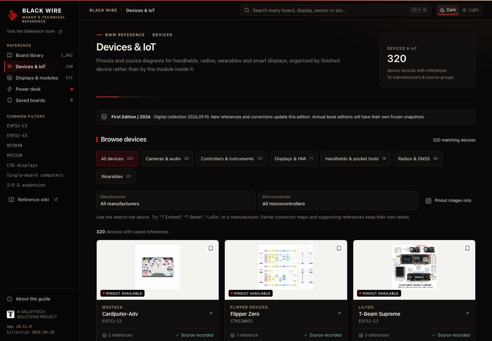
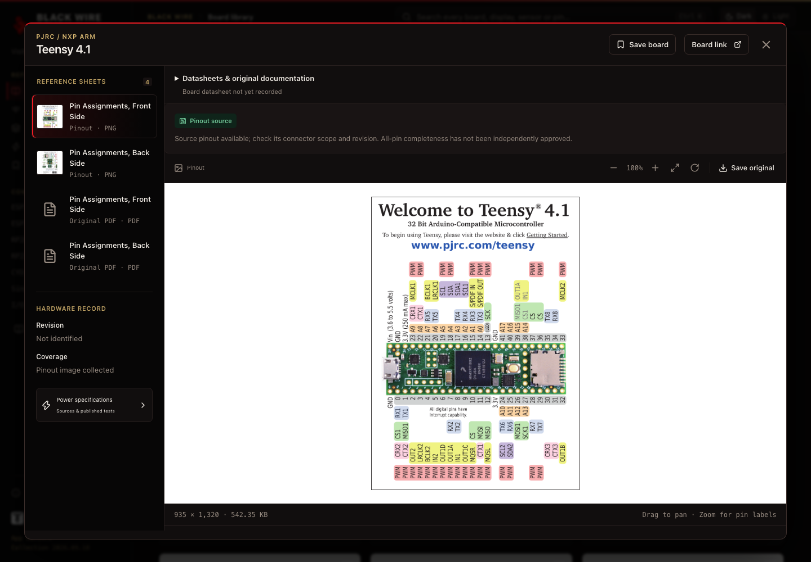
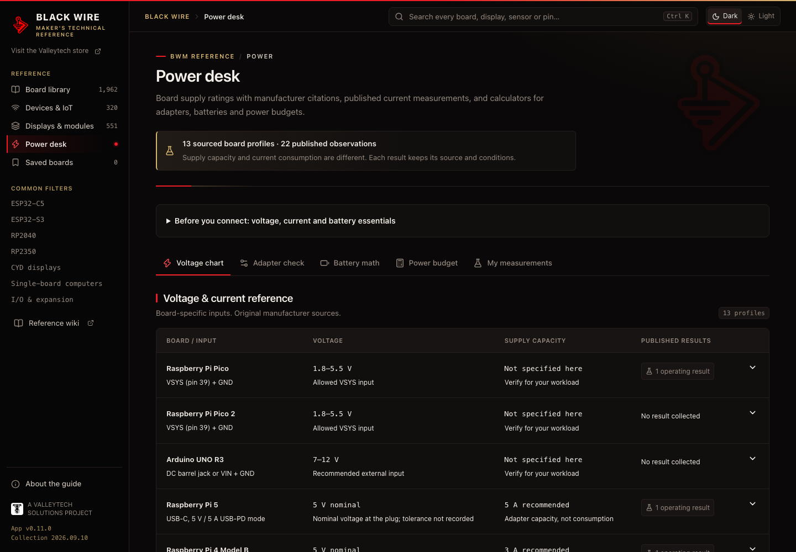
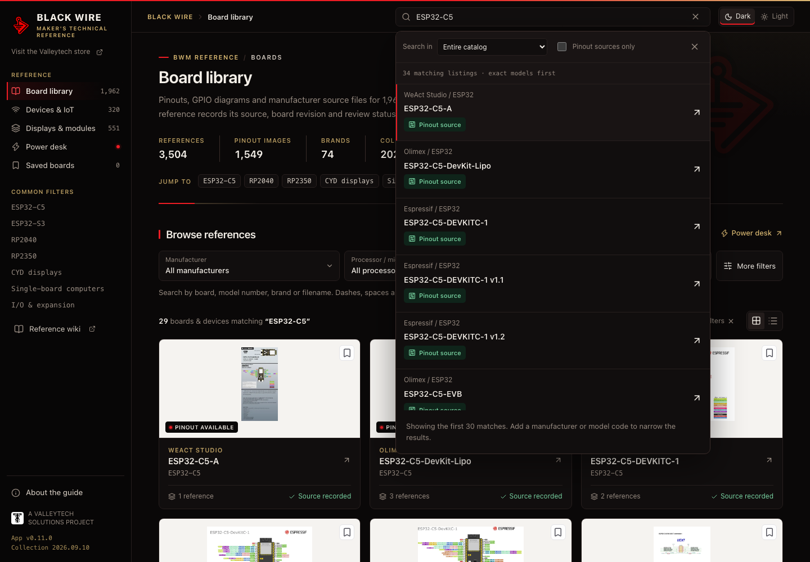

  <picture><source media="(prefers-color-scheme: dark)" srcset="public/brand/black-wire-red.png"></picture> &nbsp;&nbsp;
  

<h1 align="center">The Black Wire Maker's Technical Reference Guide</h1>

<strong>Board pinouts, manufacturer source files and power data.</strong> Every reference keeps its source, revision and review status. A Valleytech Solutions project, made for the workbench.

Makers · Educators · Students · Hobbyists · Engineers

<a href="https://github.com/valleytechsolutions/black-wire-desktop/releases">Downloads & release status</a> · <a href="https://github.com/valleytechsolutions/black-wire-pinouts">Browse the pinout collection</a> · <a href="docs/BUILDING.md">Build the app</a> · <a href="CONTRIBUTING.md">Contribute</a>

  

## Open the reference workbench

**[Use the web app](https://valleytech-black-wire-guide.pages.dev/) · [Read the wiki](https://valleytech-black-wire-guide.pages.dev/wiki/) · [Download desktop release 0.14.0](https://github.com/valleytechsolutions/BWM-Technical-Reference-Guide/releases/tag/v0.14.0)**

Find **ESP32, Arduino, Raspberry Pi, RP2040/RP2350, board pinouts, OLED/LCD/e-paper displays, sensors and maker modules**. Search the exact model, inspect the original source, check its revision and keep useful boards saved locally. Hardware coverage and missing documentation are explicit.

## New in 0.15.0

- **Breadboard maker:** combine catalog devices and basic components on mini, half or full-size breadboards (up to four per circuit, with optional split rails), connect terminals with wires, and insert parts directly into breadboard holes.
- **Device maker:** define your own modules and chips with terminal roles, a SIP/DIP/dual-row breadboard package and an optional power profile, then save them to **My devices** for reuse.
- **DC testing and measurements:** run LED, dimmer and transistor-switch examples with diodes, capacitors, push buttons, NPN/PNP transistors and active buzzers, change switches and potentiometers, inspect connected contacts, and measure voltage or continuity with the multimeter.
- **Save and assemble:** keep multiple local projects, undo edits, import/export circuit files, and download a printable build guide with lead positions, wiring checks and assembly checklists.
- [Breadboard instructions](docs/WORKBENCH.md#breadboard-maker) · [Release notes and validation status](docs/RELEASE-0.15.0.md). Version 0.15.0 is prepared in source; desktop downloads below remain on 0.14.0 pending native validation and publication.

## Previous update / 0.14.0

- **One Windows installer**, plus Linux DEB packages. No separate library ZIP parts beside Windows setup.
- **Updates inside Black Wire:** check, download, then restart when ready. Saved boards, measurements and downloaded references survive updates.
- **A persistent offline library:** search and previews are included; original files download on demand or through Download offline library, with checksum verification and retry.
- [Installation and offline setup](docs/DOWNLOADS.md) · [Release notes and native validation](docs/RELEASE-0.14.0.md).

Windows packages remain unsigned. Users of 0.13 or earlier need this installer once to gain the updater. Download all originals inside the app before relying on complete offline access. No new verified macOS package is claimed.

## Previous update / 0.13.0

- Pinch, drag, double-tap, trackpad and keyboard controls for images and PDF pages, alongside the existing zoom buttons.
- 34 additional board/module records, 12 enriched records and 104 reference attachments across RAKwireless, Heltec, Elecrow, Seeed, H4M Pro, ESP32-MDK, Hat Labs, LOLIN and REYAX.
- Exact model/revision notes, 164 sourced pin-function rows and explicit documentation gaps. [Release notes and platform status](docs/RELEASE-0.13.0.md).

## Previous update / 0.12.0

Fifteen original connection guides cover RJ45 and telephone connectors, serial buses, debug interfaces and RFID/NFC, with SVG diagrams and matching wiki pages. [Wiring release notes](docs/RELEASE-0.12.0.md).

## Previous update / 0.11.0

- **HaleHound and Elechouse references:** 32 new listings, 106 reference attachments and 36 source-linked pin-purpose rows. Exact variants, original PDFs and unresolved source conflicts remain visible. [Coverage details](https://github.com/valleytechsolutions/black-wire-pinouts/blob/main/docs/EXPANSION-2026.09.11.md).

- **A Black Wire brand theme:** red and black with a light royal-gold undertone across the app, the reference wiki, the 404 page and the share card. Red marks where you are, primary actions and pinout availability; gold carries labels, links and focus. Reference images and PDFs keep their original colors.
- **Reference-first pages:** each section opens with a plain title, a factual description and the collection figures instead of slogans and artwork. A wire underline, a faint Black Wire mark and a **BWM Reference** label identify every page.
- [Release notes](docs/RELEASE-0.11.0.md).

## Previous update / 0.10.0

- 67 Inland records with exact SKU/revision distinctions, original images and visible gaps.
- All 50 DFRobot MCU-category SKUs reviewed; additional TI, Microchip and Silicon Labs GPIO references.
- Independent offline-library ZIP parts, all checked before an existing Windows installation is changed.
- [Release notes and limitations](docs/RELEASE-0.10.0.md) · [Inland coverage](https://github.com/valleytechsolutions/black-wire-pinouts/blob/main/catalog/inland-coverage.json).

## Previous update / 0.9.0

- Faster repeated searches, correct chip/display-size matching and improved Unicode-dash handling.
- ESP-Mosaico, P4X, ELM11 Feather, Atum A3 Nano and CycloMod references, with exact scope and pre-release notes.
- Source-link availability shown beside documents; malformed imports, duplicate measurement IDs and a corrupt source image corrected.
- Diagrams open in view; expandable documentation and visible pre-release notes work on mobile too.
- [Audit results, performance measurements and remaining limits](docs/RELEASE-0.9.0.md).

## Previous update / 0.8.0

- **Jetson, NanoPi and I/O boards:** 75 added listings, eight previously empty records populated, 114 new references and 15 physical pinout-image entries.
- **Documentation on every listing:** separate board datasheet, original website and visual-reference status. Manuals, schematics and chip datasheets retain their own labels. Missing documents remain explicit.
- **Better model search:** `RAK-13002` finds `RAK13002`; numeric suffixes still distinguish different models.
- **I/O & expansion browsing** and a new documentation wiki guide. [Release details and limits](docs/RELEASE-0.8.0.md).

## Previous update / 0.7.0

- **More manufacturer references:** 107 additional board/device listings, 229 reference entries and 15 linked maker records, including Adafruit, SparkFun, FPGA boards, H4M, LattePanda and Milk-V Mars.
- **SBC and FPGA shortcuts:** browse single-board computers together, then filter ARM, x86 or RISC-V. Mixed-architecture boards appear under either matching architecture.
- **Specifications close to the diagram:** visible links to manufacturer hardware documentation, with dedicated specs distinguished from general sources.
- **A new SBC wiki guide** and corrected model identities. [Release details and limits](docs/RELEASE-0.7.0.md).

## Previous update / 0.6.1

- PDF touch scrolling, intrinsic page rotation, direct page selection and retry after a failed load. High zoom uses a bounded canvas allocation.
- Zoomed, rotated images keep all corners reachable; malformed saved measurements cannot crash the workbench or overwrite saved data.
- Two newly tracked SparkFun ESP32 models and eight source reference entries in collection **2026.09.6**. [Verification and remaining limits](docs/RELEASE-0.6.1.md).

## Introduced in 0.6.0

- **Dark mode by default:** warm charcoal, gold highlights and the official red Black Wire logo. Light mode uses a warm paper palette; your choice persists locally.
- **A redesigned workbench:** a circuit-inspired opening panel, consistent controls and readable dark viewers, tables and power tools. Reference images keep their original colors.
- **A public reference wiki:** eight practical guides and catalog directories for every current board and maker listing. The wiki works without JavaScript; directory filtering is an optional enhancement.
- **Better discovery:** useful titles and descriptions, canonical links, social previews and a sitemap. GitHub wiki pages and issue templates make corrections and contributions easier.
- **Useful edge-case fixes:** saved theme synchronization across tabs, a clear fallback when storage is blocked, and direct links to undocumented board records.

The current collection is **2026.09.13**: 2,703 board/device listings and 575 maker listings, including families and shared records. A physical source is not an independently approved all-pin reference. [Coverage audit](https://github.com/valleytechsolutions/black-wire-pinouts/blob/main/PINOUT_COVERAGE.md).

## Your board. Its pins. One place.

Black Wire is an offline desktop workbench for the moment you need to know **what that pin does**. Find the exact board, open its original pinout, check its revision and source, and keep the references you use most within reach.

Built for a student's first breadboard, an educator's lab, a hobbyist's parts drawer and an engineer's prototype bench.

| At your bench | What the app does |
|---|---|
| Find the right board | Search names, aliases and filenames; filter manufacturer, MCU variant, family and review status. Dashes, spaces and underscores work interchangeably. |
| Find a maker device | Dedicated Devices & IoT tab with 320 device records, category filters, exact model references and visible documentation gaps. |
| Read the details | Zoom, pan and rotate diagrams; browse local PDFs; save the original-resolution file. |
| Check the source | Keep source links, revision notes, coverage labels and hashes with each reference. |
| Plan power | Read sourced voltage/current profiles and published observations; compare adapter ratings, estimate battery runtime and total power across voltage rails. |
| Prototype a circuit | Place and insert parts on one or more breadboards, define reusable devices, and run a basic DC test with voltage probes, LED feedback and device limit checks. |
| Keep your work | Save boards and your own measurements locally; import/export JSON backups. |
| Stay offline | The desktop reference library is bundled locally. External source, wiki and YouTube links open only when selected. No account or cloud sync. |

### A growing library

**3,504 reference entries · 1,549 board pinout source image entries · 74 brands/source groups.** There are 1,962 populated catalog records, including shared references and unreviewed source products. This is a collection snapshot, not a claim to cover every board ever made.

ESP32 variants including C5/C6/S3, RP2040/RP2350, CYD displays, Arduino, Teensy, Raspberry Pi, other SBCs, radio boards and GPIO devices are indexed separately where their identities are known. Chip-package references are labeled separately from board pinouts.

## Breadboard & device maker

Open **Breadboard maker** in the sidebar, or choose **Add to breadboard** from a board or module reference. Place supplies, resistors, LEDs, diodes, capacitors, switches, push buttons, potentiometers, transistors and buzzers; click two terminals to wire them together. Each breadboard connects A–E and F–J separately in each column. Choose a mini (17-column, no rails), half (30-column) or full-size (63-column) board, split its power rails at the middle, and add up to four boards to one circuit. Drag component headers to arrange your circuit; placement alone does not connect a terminal.

**Insert parts directly:** select a part, choose **Insert into breadboard**, then choose its holes. Two-lead parts take any two holes; potentiometers, transistors, push buttons and packaged devices follow their footprint from pin 1, with a preview and **R** to rotate. The leads join the board’s electrical strips without extra jumpers. Drag inserted parts or use arrow keys to move by holes; **Move leads** chooses a different orientation, and **Lift from breadboard** returns the part to the workspace. Copper outlines identify occupied holes. **Load inserted LED** gives you a complete three-part circuit with four jumper wires; **Load transistor switch** lights an LED only while you hold a push button.

**Make your own devices:** the **Device maker** tab edits a custom or catalog device: paste terminal labels in pin order, assign roles (power, ground, GPIO, bus…), choose a breadboard package, and optionally enter its voltage range and current draw. The DC test then draws that current and flags supply voltage outside your range or overdriven inputs; the build guide flags reversed power and VCC–GND shorts. Save it to **My devices** to reuse it in any circuit, or export the library as JSON. Roles and limits are the values you enter, not inferred datasheets.

**Load LED example → Run DC test** starts a working circuit. Change resistor or supply values, toggle the switch, and use **Probe** to inspect node voltages. The test estimates steady DC currents and flags supply shorts, excessive LED current, reverse LED polarity and resistor dissipation above the example rating.

Catalog boards, sensors and displays are available as **wiring references**, showing their original reference artwork where available. Edit terminal labels and place contacts on that artwork; unplaced terminals retain a logical layout. Rotation and duplication preserve terminal identities, and attached wires follow components. They do not yet simulate firmware, GPIO, sensors or communication protocols. The DC model uses ideal connections and supplies plus simplified LEDs, diodes and transistors; capacitors are treated as fully charged. It does not certify a physical build.

Use **Projects** to keep up to 50 separate local circuits, reopen builds, save copies, and delete individual projects. New circuits, examples and imports preserve your existing builds. Version 1 and 2 circuit files upgrade automatically to version 3, which preserves inserted lead connections. The original legacy single-circuit save remains untouched. The breadboard's **Export / Import** controls use JSON files separately from the About-page bookmark/measurement backup. Editing supports undo/redo within the current project session. [Workbench instructions](docs/WORKBENCH.md#breadboard-maker).

**Shape the wiring:** double-click a wire to add a bend, drag bend handles, label a wire, or reconnect either endpoint. Select a connection to highlight its breadboard net. Pan, zoom, expanded workspace, connection lists and a parts list help with larger builds.

**Measure and build:** use **Multimeter** for two-lead DC voltage measurements and direct-path continuity checks. The **Build guide** groups your parts, flags shared holes and bypassed components, and saves a per-wire assembly checklist and notes. Download a self-contained HTML build sheet with a vector layout and exact terminal-to-terminal instructions; open it to print or save as PDF. Catalog devices remain wiring references, not simulated firmware.

**Try a complete adjustable build:** load the **dimmer example**, run the DC test, select the potentiometer and move **Wiper position**. Its two resistive track segments and the LED load are solved together, so the displayed current and LED brightness respond to the actual connections. This generic analog model does not run microcontroller firmware.

## Devices & IoT

Browse handhelds, radios, wearables, displays, cameras and controllers. Search T-Embed, T-Beam, Cardputer or Flipper Zero using the same dash-tolerant search. In-development documentation is labeled; missing pinout images stay in a documentation-watch list.

The guide is **First Edition / 2026**, with digital collection snapshot **2026.09.10**. App updates and collection snapshots do not advance the annual book edition. See [publication workflow](docs/MAINTENANCE.md).

## Look closer

Original images stay intact. Partial maps and unknown revisions remain visible so users can compare the reference with the board on their bench.

The power desk includes **13 sourced profiles and 22 published operating observations**. Manufacturer requirements, nominal values, published measurements and personal bench readings are distinct. Unknown values stay unknown. Published observations were not measured by Black Wire; a typical current reading is not a guaranteed maximum or a supply recommendation.

## Download and open

Check [Releases](https://github.com/valleytechsolutions/black-wire-desktop/releases) for the actual available assets and validation status. An absent platform asset means that platform has not been released.

**[Download release 0.14.0](https://github.com/valleytechsolutions/BWM-Technical-Reference-Guide/releases/tag/v0.14.0)**. For original images and PDFs without an application, use the separate [collection downloads](https://github.com/valleytechsolutions/black-wire-pinouts/releases).

| Platform | Package |
|---|---|
| Windows x64 | Single setup EXE. Unsigned; operating-system reputation warnings remain possible. |
| Linux x64 | DEB for Ubuntu/Debian desktops. See release reports for tested environments. |
| macOS Intel / Apple Silicon | Source/build targets remain available; no new verified Mac binary is included. |

Install once, then use **Updates & offline library** for software updates and the complete offline collection. There are no separate library ZIP parts to place beside Windows setup. Bookmarks, measurements and downloaded references persist across updates. [Instructions, checksums and requirements](docs/DOWNLOADS.md).

## Browser edition for the Valleytech store

**[Open BWM-Technical Reference Guide on the Valleytech store](https://valleytechsolutions.tech/pages/bwm-technical-reference-guide)** — or [open the guide full screen](https://valleytech-black-wire-guide.pages.dev/).

The complete current catalog is available in your browser. Search, view pinouts/PDFs and use power tools without installing an app. References load on demand; browser bookmarks and measurements stay local. The live Shopify embed has been checked on desktop and phone widths. The desktop edition remains available for offline use.

See [Website integration](docs/WEBSITE.md) for the prepared page, build commands and hosting requirements.

## Two repositories, one field guide

- **[black-wire-pinouts](https://github.com/valleytechsolutions/black-wire-pinouts):** images, PDFs, catalog, board pages and per-reference attribution.
- **This repository:** desktop application, power data, UI screenshots, tests and packaging. Large library files are imported during a build; personal bookmarks and measurements are never part of the repository.

Power Desk 0.7.0 adds explicit current units, confirmation resets after rating changes, visible input notes, linked observation sources and battery derating. Read the [Power Desk guide](docs/wiki/power-desk.md) and [source review](https://github.com/valleytechsolutions/black-wire-pinouts/blob/main/docs/POWER-REVIEW-2026.09.7.md).

See [Build and development](docs/BUILDING.md), [Workbench guide](docs/WORKBENCH.md), [Attribution](ATTRIBUTION.md) and [Contribution guide](CONTRIBUTING.md).

## Attribution and project status

Original board artwork belongs to its credited authors/manufacturers. This application does not claim ownership or grant new permissions over those references. See the collection's [per-asset ledger](https://github.com/valleytechsolutions/black-wire-pinouts/blob/main/catalog/attributions.csv) before reuse. **Original app code: [MIT](LICENSE)** — reuse and modify, including commercially, while retaining the copyright and permission notice. **Original guide material: CC BY 4.0** — reuse with attribution, a license link and a note of changes. See [license scope](LICENSING.md), [creator credit](NOTICE.md) and [privacy](PRIVACY.md). These licenses do not relicense manufacturer diagrams.

First Edition is a growing digital collection for a lasting maker reference. The public wiki is available; annual print editions are a future project, with separate completeness, rights and print-quality reviews.

---
Created and curated by **—your pal kal** · [@valleytechsolutions on YouTube](https://www.youtube.com/@valleytechsolutions)

Black Wire and Valleytech logos belong to their creator. Manufacturer names and trademarks identify the referenced hardware; they do not imply endorsement.

## Wiring & protocols

[Open the wiring desk](https://valleytech-black-wire-guide.pages.dev/?tab=wiring) · [Read the wiring wiki](https://valleytech-black-wire-guide.pages.dev/wiki/wiring/)

Version 0.12.0 adds 15 original connection diagrams and guides for RJ45/8P8C Ethernet, telephone terminals, UART, RS-232, RS-485, CAN, I2C, SPI, SWD, JTAG and RFID/NFC. Search by protocol or module, zoom and save diagrams, and open exact module references. Scope, signal direction, source documents and untested status stay visible. These are separate from physical board pinout counts. [Release details](docs/RELEASE-0.12.0.md).
